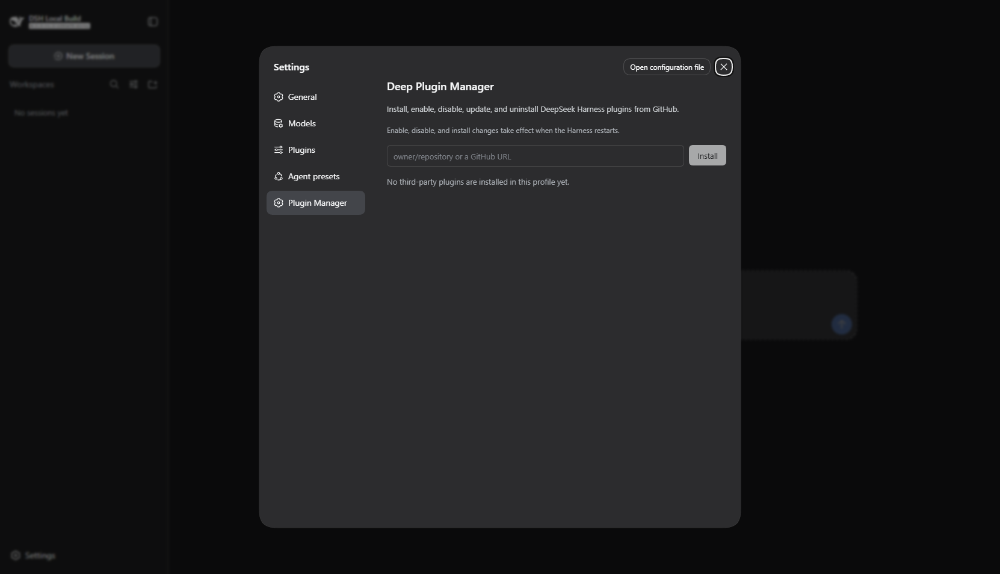

<div align="center">

# Deep Plugin Manager

**Install, enable, disable, update, and uninstall DeepSeek Harness plugins from GitHub — right from the Settings UI.**

A standalone [DeepSeek Harness](https://github.com/deepseek-ai/deepseek-harness) plugin that turns GitHub-hosted plugins into a managed lifecycle instead of a manual `pnpm` ritual.

[](LICENSE)
[](https://github.com/deepseek-ai/deepseek-harness)
[](#contributing)



</div>

## Why it exists

The Harness's plugin system is built on npm semantics: plugins are packages in a profile directory, enabled through the profile manifest. That is a great foundation — and it means managing plugins by hand means running pnpm commands and editing JSON. Deep Plugin Manager puts a clean, native face on those mechanics: paste `owner/repository`, click Install, toggle, update, remove. No terminal required, and **no parallel plugin system** — every operation goes through the exact state the Harness itself reads.

## Features

- **Install** from `owner/repository`, a github.com URL, or a `#tag`/branch pin
- **Enable / disable** installed plugins (disabled plugins stay installed)
- **Update** from the plugin's GitHub releases, preserving enabled state
- **Check for updates** against the repository's latest published release
- **Uninstall** with safe cleanup
- **Validated installs** — the fetched package must satisfy the Harness plugin contract (`dsh.bundle.patch`), or the install is rolled back
- **Clean failures** — pnpm output is captured and surfaced in the UI; nothing is left half-installed
- Works entirely over the **profile's own state** — no separate registry to fall out of sync

## The plugin format

Deep Plugin Manager manages plugins the way the Harness defines them: an npm package whose `package.json` declares

```json
{
  "name": "dsh-my-plugin",
  "dsh": {
    "bundle": { "patch": "./cordis.patch.yml" }
  }
}
```

That one declaration is the whole contract. A plugin repository needs no special layout beyond it — see [`deep-contrast`](https://github.com/temidayoxyz/deep-contrast) or [`deep-design`](https://github.com/temidayoxyz/deep-design) for complete examples.

## Install

Inside any DeepSeek Harness checkout:

```sh
pnpm dsh plugin --profile web add github:temidayoxyz/deep-plugin-manager
```

> pnpm ≥ 10 may block the package's build script on first install. Add the key it prints under `allowBuilds` in the profile's `pnpm-workspace.yaml`, then re-run the command.

Then start (or restart) the web UI and open **Settings → Plugin Manager**.

## Managing plugins

| Operation | How |
| --- | --- |
| Install | Paste `owner/repository` (or a GitHub URL) into the install box, click **Install** |
| Enable / disable | Click the status pill on a plugin row; the change applies at the next Harness restart |
| Check for updates | Click **Check for updates** on a row — the manager asks GitHub for the latest release |
| Update | Click **Update**; updates pin to the latest published release and preserve enabled state |
| Uninstall | Click **Uninstall**, then confirm |

Accepted repository references:

```
temidayoxyz/deep-contrast
temidayoxyz/deep-contrast#v1.2.0
github:temidayoxyz/deep-contrast
https://github.com/temidayoxyz/deep-contrast
https://github.com/temidayoxyz/deep-contrast/tree/v1.2.0
```

Unpinned installs track the repository's default branch; `#tag` installs pin to that tag. Public repositories need no authentication — if `GITHUB_TOKEN` is present in the environment, the manager uses it for release checks and higher rate limits.

## Safety model

- **No partial installs.** pnpm is transactional for `add`; if validation fails after a fetch (not a Harness plugin, reserved name), the package is removed and the manifest restored before the error surfaces.
- **No destroyed state.** Uninstall detaches the bundle entry first; if package removal fails, the entry is restored. Update failures leave the previous installation untouched.
- **No core access.** `@deepseek-ai/*` packages and the manager itself are refused everywhere.
- **No shell injection.** Every spawned argument is validated against a safe charset; repository references that contain anything unusual are rejected at parse time.
- **No surprise network.** Server requests go only to `api.github.com`, `github.com`, and `codeload.github.com` over https.
- **Atomic manifest writes.** The profile manifest is written temp-file-then-rename.

## How it works

```
Settings UI (browser half)
  └─ same-origin fetch ──► /deep-plugin-manager/* routes (Host half)
                             ├─ profile.ts     the Harness profile manifest = the state
                             ├─ lifecycle.ts   install / enable / disable / update / uninstall
                             ├─ github.ts      reference parsing, host allowlist, releases
                             └─ runner.ts      validated pnpm spawns in the profile directory
```

The manager runs `pnpm` inside the profile directory — the same mechanics as the `dsh plugin` CLI — and reads/writes the profile manifest the same way the Harness desktop app does. Enable/disable is membership in `dsh.profile.bundles`; installed state is the `dependencies` map. Because those files are the Harness's source of truth, anything the manager does is visible to (and reversible by) the CLI.

One behavior to know: **enable, disable, and install take effect when the Harness restarts** — the running UI keeps its loaded plugins until then. The page says so at the top.

## Development

```sh
pnpm install      # dev dependencies: tsdown, typescript, react types, node types
pnpm build        # build lib/ (host entry + browser client bundle)
pnpm typecheck    # tsc --noEmit
pnpm test         # node:test suites over a fake pnpm (no network needed)
```

The lifecycle engine takes its pnpm runner and GitHub lookup as injected dependencies, so `tests/lifecycle.spec.ts` exercises the full state machine — install, rollback, duplicates, enable/disable, uninstall failure recovery, update flows — against temp directories without touching the network.

To try changes against a running Harness:

```sh
pnpm build
pnpm dsh web --patch D:/path/to/deep-plugin-manager/cordis.patch.yml --no-open
```

## Contributing

Issues and pull requests are welcome. Good first contributions: batch update checks, an update-available indicator on boot, and per-plugin GitHub metadata (stars, description) in the list.

## License

[MIT](LICENSE)
